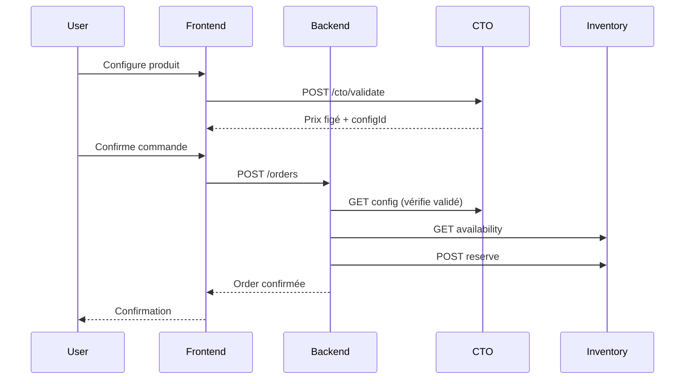
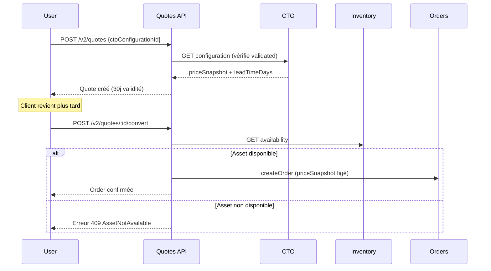

# E-commerce B2B v1

Plateforme e-commerce B2B pour la vente de serveurs IT refurbished.

## Philosophie

> **Le e-commerce ne pense pas, il orchestre.**

Le frontend affiche **exactement** ce que les services ERP retournent. Aucune validation métier côté front.

## Architecture

```
ecommerce-service/
├── frontend/               # Next.js (Port 3007)
│   ├── pages/
│   │   ├── index.tsx           # Catalogue produits
│   │   ├── products/[id].tsx   # Fiche produit
│   │   └── cto/[assetId].tsx   # Configurateur CTO
│   ├── components/
│   │   ├── ProductCard.tsx
│   │   ├── AssetDetails.tsx
│   │   └── CtoConfigurator.tsx
│   └── services/
│       └── api.ts              # Appels API
└── backend/                # Express (Port 3006)
    └── src/
        ├── routes/order.routes.ts
        ├── controllers/order.controller.ts
        ├── services/order.service.ts
        └── integrations/
            ├── asset.client.ts
            ├── inventory.client.ts
            └── cto.client.ts
```

## Dépendances Inter-Services

| Service | Endpoint | Usage |
|---------|----------|-------|
| Asset Service | `/assets` | Liste produits, détails |
| Inventory Service | `/inventory/assets/{id}/availability` | Disponibilité réelle |
| Inventory Service | `/inventory/assets/{id}/reserve` | Réservation |
| CTO Service | `/cto/validate` | Validation configuration |
| CTO Service | `/cto/configurations/{id}` | Récupération config |

## Workflow Commande



## Règles Strictes

1. **Aucune estimation** - Données réelles uniquement
2. **Prix figé** - Vient du CTO, jamais modifié
3. **Réservation réelle** - Avant confirmation commande
4. **Pas de DB directe** - Appels API uniquement

## Démarrage

### Backend

```bash
cd backend
npm install
npm run dev    # Port 3006
```

### Frontend

```bash
cd frontend
npm install
npm run dev    # Port 3007
```

## Tests

```bash
cd backend
npm test
```

## Configuration

### Backend

```env
PORT=3006
ASSET_SERVICE_URL=http://localhost:3000
INVENTORY_SERVICE_URL=http://localhost:3003
CTO_SERVICE_URL=http://localhost:3005
```

### Frontend

```env
NEXT_PUBLIC_BACKEND_URL=http://localhost:3006
NEXT_PUBLIC_ASSET_SERVICE_URL=http://localhost:3000
NEXT_PUBLIC_INVENTORY_SERVICE_URL=http://localhost:3003
NEXT_PUBLIC_CTO_SERVICE_URL=http://localhost:3005
```

## Sprint 13 - Devis CTO B2B

Le système de devis permet de figer une configuration CTO pour un client B2B.

### API V2 Endpoints

| Méthode | Endpoint | Description |
|---------|----------|-------------|
| `POST` | `/v2/quotes` | Créer un devis depuis un CTO validé |
| `GET` | `/v2/quotes` | Lister les devis (avec filtres) |
| `GET` | `/v2/quotes/:id` | Récupérer un devis |
| `POST` | `/v2/quotes/:id/convert` | Convertir en commande |

### Filtres GET /v2/quotes

- `?status=ACTIVE|EXPIRED|CONVERTED`
- `?expiresAfter=2026-02-01`
- `?expiresBefore=2026-03-01`

### Règles Métier

1. **Prix figé** - Le `priceSnapshot` vient du CTO et n'est JAMAIS recalculé
2. **Validité 30 jours** - Expiration automatique après création
3. **Isolation entreprise** - Un client ne voit que ses propres devis
4. **Vérification Inventory** - La disponibilité est vérifiée à la conversion
5. **Conversion unique** - Un devis converti ne peut plus être modifié

### Workflow Devis → Commande



### Rôles Requis

- **ACHETEUR** : Créer et convertir des devis
- **LECTURE** : Consulter les devis uniquement

## Sprint 14 - Options Premium & Garanties

Les options premium permettent d'ajouter des services à une commande sans modifier le CTO.

### Principe clé : Séparation Matériel / Services

```
┌─────────────────────────────────────────────────┐
│ COMMANDE B2B                                    │
├─────────────────────────────────────────────────┤
│ 📦 MATÉRIEL (CTO)                               │
│    priceSnapshot = 2 937,50 €  ← JAMAIS modifié│
├─────────────────────────────────────────────────┤
│ ⚙️ OPTIONS (Prix FIGÉ à l'ajout)                │
│    Garantie 3 ans     =   199,00 €              │
│    Étiquetage client  =    15,00 €              │
├─────────────────────────────────────────────────┤
│ TOTAL COMMANDE        = 3 151,50 €              │
└─────────────────────────────────────────────────┘
```

### API V2 Endpoints

| Méthode | Endpoint | Description |
|---------|----------|-------------|
| `GET` | `/v2/options` | Catalogue des options actives |
| `GET` | `/v2/options/:id` | Détail d'une option |
| `POST` | `/v2/orders/:orderId/options` | Ajouter options à une commande |
| `GET` | `/v2/orders/:orderId/options` | Lister options d'une commande |

### Catalogue options

| Catégorie | Option | Prix |
|-----------|--------|------|
| WARRANTY | Extension garantie 3 ans | 199 € |
| WARRANTY | Extension garantie 5 ans | 349 € |
| SERVICE | Batterie neuve | 89 € |
| SERVICE | Pré-installation logicielle | 49 € |
| SERVICE | Étiquetage personnalisé | 15 € |
| SERVICE | Tag RFID inventaire | 25 € |

### Règles Métier

1. **Prix figé** - Le prix de l'option est figé au moment de l'ajout
2. **CTO intouchable** - Le `priceSnapshot` matériel n'est JAMAIS modifié
3. **Pas d'ajout post-expédition** - Impossible d'ajouter des options après expédition
4. **Pas de dépendances** - Les options sont indépendantes les unes des autres
5. **Lisibilité B2B** - Séparation claire matériel / services sur les documents

## Sprint 15 - Vente Assistée B2B

Le système de vente assistée permet l'accompagnement commercial sur des devis longs sans compromettre l'intégrité du snapshot.

### Philosophie

```
┌─────────────────────────────────────────────────┐
│ DEVIS = SNAPSHOT INVIOLABLE                     │
├─────────────────────────────────────────────────┤
│ ✅ Commentaires                                 │
│ ✅ Pièces jointes (internes)                   │
│ ✅ Prolongation (SALES_INTERNAL)               │
├─────────────────────────────────────────────────┤
│ ❌ Modification CTO                            │
│ ❌ Modification prix                           │
│ ❌ Suppression historique                      │
└─────────────────────────────────────────────────┘
```

### API V2 Endpoints

| Méthode | Endpoint | Rôles | Description |
|---------|----------|-------|-------------|
| `POST` | `/v2/quotes/:id/comments` | Tous | Ajouter un commentaire |
| `POST` | `/v2/quotes/:id/attachments` | Internes | Ajouter une pièce jointe |
| `GET` | `/v2/quotes/:id/timeline` | Tous | Historique chronologique |
| `POST` | `/v2/quotes/:id/extend` | SALES_INTERNAL | Prolonger le devis |

### Rôles

| Rôle | Commenter | PJ | Prolonger | Convertir |
|------|-----------|-----|-----------|-----------|
| CLIENT | ✅ | ❌ | ❌ | ✅ |
| SALES_INTERNAL | ✅ | ✅ | ✅ | ❌ |
| TECH_INTERNAL | ✅ | ✅ | ❌ | ❌ |

### Règles Métier

1. **Append-only** - Aucune suppression d'historique
2. **Prolongation tracée** - Commentaire automatique à chaque extension
3. **Pas d'édition** - Le priceSnapshot reste figé
4. **Isolation entreprise** - Commentaires visibles par le client concerné

## Sprint 16 - Facturation & Paiement B2B

Génération de factures opposables, paiement différé 30 jours.

### Philosophie

```
┌─────────────────────────────────────────────────┐
│ FACTURE = DOCUMENT LÉGAL                        │
├─────────────────────────────────────────────────┤
│ ✅ Montant copié de la commande                 │
│ ✅ PDF opposable après émission                 │
│ ✅ Paiement différé (30 jours)                  │
├─────────────────────────────────────────────────┤
│ ❌ Recalcul de montant                         │
│ ❌ Modification après émission                  │
│ ❌ Suppression de facture                       │
└─────────────────────────────────────────────────┘
```

### API V2 Endpoints

| Méthode | Endpoint | Rôles | Description |
|---------|----------|-------|-------------|
| `POST` | `/v2/orders/:id/invoice` | Interne | Créer facture |
| `POST` | `/v2/invoices/:id/issue` | Interne | Émettre (PDF) |
| `GET` | `/v2/invoices/:id` | Tous | Consulter facture |
| `POST` | `/v2/invoices/:id/payments` | Interne | Enregistrer paiement |

### Cycle de vie

```
DRAFT → [émission] → ISSUED → [paiement] → PAID
```

### Règles Métier

1. **Montant figé** - Copie exacte du total commande
2. **Pas de recalcul** - Le montant n'est JAMAIS recalculé
3. **Échéance auto** - dueAt = issuedAt + 30 jours
4. **Paiement interne** - Seul un interne peut marquer "payé"

## Limites v1

- Pas de TVA multi-taux complexe
- Pas d'avoir (credit note)
- Pas de relance automatique
- Pas d'export comptable
- Pas de bundles d'options
- Pas de remises sur options
- Événements en console.log

