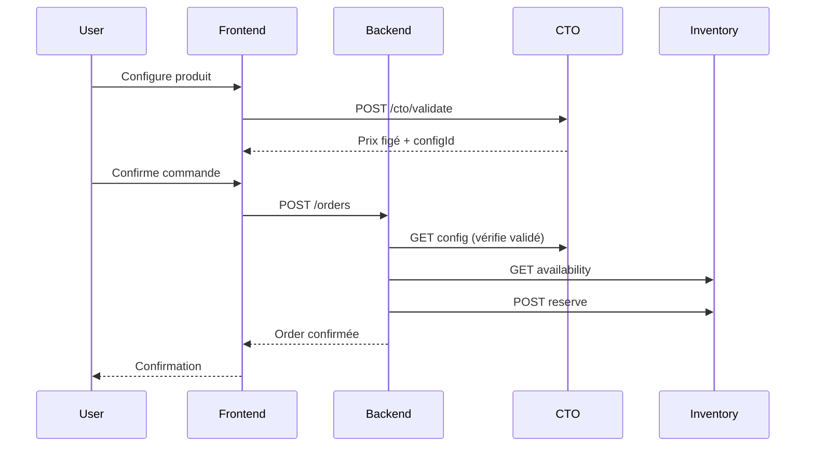

# E-commerce B2B v1

Plateforme e-commerce B2B pour la vente de serveurs IT refurbished.

## Philosophie

> **Le e-commerce ne pense pas, il orchestre.**

Le frontend affiche **exactement** ce que les services ERP retournent. Aucune validation métier côté front.

## Architecture

```
ecommerce-service/
├── frontend/               # Next.js (Port 3007)
│   ├── pages/
│   │   ├── index.tsx           # Catalogue produits
│   │   ├── products/[id].tsx   # Fiche produit
│   │   └── cto/[assetId].tsx   # Configurateur CTO
│   ├── components/
│   │   ├── ProductCard.tsx
│   │   ├── AssetDetails.tsx
│   │   └── CtoConfigurator.tsx
│   └── services/
│       └── api.ts              # Appels API
└── backend/                # Express (Port 3006)
    └── src/
        ├── routes/order.routes.ts
        ├── controllers/order.controller.ts
        ├── services/order.service.ts
        └── integrations/
            ├── asset.client.ts
            ├── inventory.client.ts
            └── cto.client.ts
```

## Dépendances Inter-Services

| Service | Endpoint | Usage |
|---------|----------|-------|
| Asset Service | `/assets` | Liste produits, détails |
| Inventory Service | `/inventory/assets/{id}/availability` | Disponibilité réelle |
| Inventory Service | `/inventory/assets/{id}/reserve` | Réservation |
| CTO Service | `/cto/validate` | Validation configuration |
| CTO Service | `/cto/configurations/{id}` | Récupération config |

## Workflow Commande



## Règles Strictes

1. **Aucune estimation** - Données réelles uniquement
2. **Prix figé** - Vient du CTO, jamais modifié
3. **Réservation réelle** - Avant confirmation commande
4. **Pas de DB directe** - Appels API uniquement

## Démarrage

### Backend

```bash
cd backend
npm install
npm run dev    # Port 3006
```

### Frontend

```bash
cd frontend
npm install
npm run dev    # Port 3007
```

## Tests

```bash
cd backend
npm test
```

## Configuration

### Backend

```env
PORT=3006
ASSET_SERVICE_URL=http://localhost:3000
INVENTORY_SERVICE_URL=http://localhost:3003
CTO_SERVICE_URL=http://localhost:3005
```

### Frontend

```env
NEXT_PUBLIC_BACKEND_URL=http://localhost:3006
NEXT_PUBLIC_ASSET_SERVICE_URL=http://localhost:3000
NEXT_PUBLIC_INVENTORY_SERVICE_URL=http://localhost:3003
NEXT_PUBLIC_CTO_SERVICE_URL=http://localhost:3005
```

## Limites v1

- Pas de paiement
- Pas de compte client avancé
- Pas de panier multi-produits
- Pas de SEO avancé
- Pas de promos
- Événements en console.log
